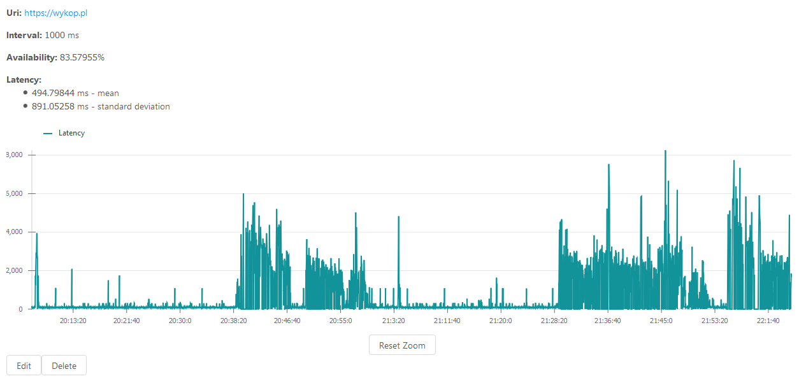

# uptime

Monitor websites status



## Features

- Custom poll frequency
- Monitor availability, average/standard deviation latency, total uptime/downtime
- JWT Authentication
- Ant Design

## Running (only development build yet)

Requires:

- JDK 8
- Node 8
- Docker

Clone repository

```sh
$ git clone git://github.com/Nalad/uptime.git
$ cd uptime
```

Run database

```sh
$ cd database
$ docker image build -t database:dev .
$ docker run -p 5432:5432 database:dev
```

Run backend

```sh
$ cd backend
$ export POSTGRES_DB="uptime"
$ export POSTGRES_USERNAME="postgres"
$ export POSTGRES_PASSWORD="postgres@123"
$ ./gradlew assemble
$ java -Dspring.profiles.active=dev -jar ./backend/build/libs/pompom-0.0.1-SNAPSHOT
```

Run frontend

```sh
$ cd frontend
$ npm install
$ npm run dev
```

## API

All API requests are prefixed with `api`.
API requests require JWT token in Authorization Header.

#### `GET /checks`

Return a list of all checks with polls

#### `POST /checks`

Create a new check

Parameters:

- `uri`: URL of the check
- `name`: name of the check
- `interval`: interval of polling

#### `DELETE /checks`

Delete the check

Parameters:

- `name`: name of the check
